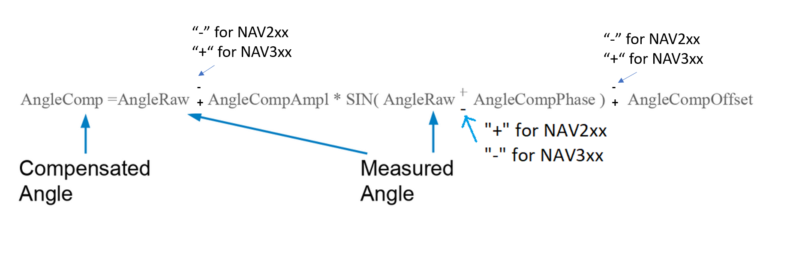
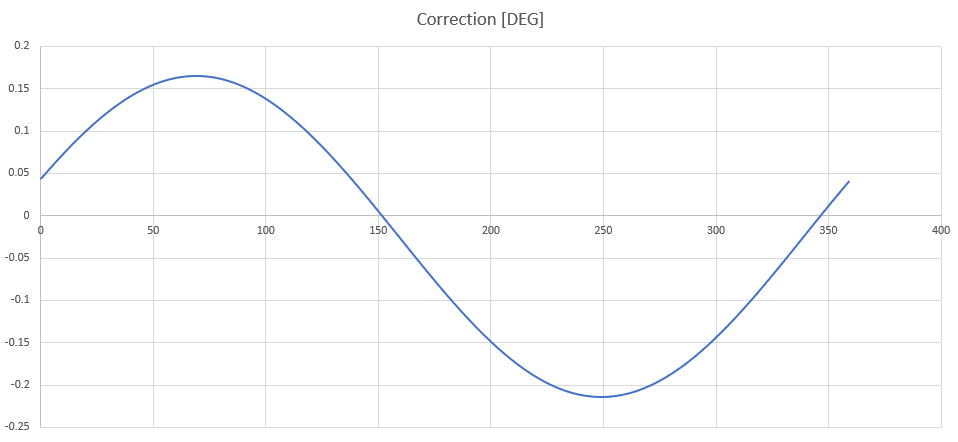

# Angle Compensation
## Table of contents

- [Introduction](#introduction)
- [Example](#example)
- [Comparing compensated vs. raw values](#comparing-compensated-vs-raw-values)
- [Check compensation function](#check-compensation-function)

## Introduction

For measurements with the highest demands on the accuracy of the angle measurement, the devices of the NAV series allow compensation of slight angle deviations during a rotation. The compensation is determined by the three parameters. 
* Additive compensation by an angle offset
* Sinusoidal correction by specifying the amplitude and phase of compensation

The three parameters are then used to calculate the compensation as follows:

 

Offset and phase are given in [deg]

## Example

The information is read from lidar by using the command `sRN MCAngleCompSin`.
The answer gives one amplitude, phase and offset compensation in tens of thousands. 

The function reads
* Amplitude-Parameter: +1893
* Phase-Parameter: -210503
* Offset-Parameter: -245

These corresponds to:
* Amplitude-compensation: +0.1893
* Phase-Compensation: -21.0503 [deg]
* Offset-Compensation: -0.0245 [deg]

## Comparing compensated vs. raw values

For the example the compensation function looks like this (X-Axis: measured angle [deg], Y-Axis: compensation in [deg])

 

## Coordinate systems

For a better understanding of the data sheets of the different lidar systems the following drawings compare the different coordinate systems. Usually the scanners rotate counter-clockwise. The scanners of the NAV3xx series rotate clockwise. All coordinate systems following the right-hand rule, if the axis definition as shown in the picture is used. 
 

By means of simple matrix operations all axis orientations can be transformed into each other. But since we are only interested in the angle around the Z-axis, the conversions can be done as follows (CS = Coordinate System):

|IN From | Out To | Operation    | Additional info                | 
|--------|--------|--------------|--------------------------------|
| ROS    | NAV3xx | Out=-In+180  | maps [-180...180] to [360...0] |
| NAV3xx | ROS    | Out=-In+180  | maps [0...360] to [180...-180] |
| ROS    | NAV2XX | Out=In+90°   |                                |
| NAV2xx | ROS    | Out=In-90°   |                                | 

## Check compensation function

By using `Octave` ones can check the compensation function against the given values by exporting the value via a testbed function.
<!--
   40 a = dlmread("angle_compensation_debug.csv",';',1,0);
   41 size(a)
   42 a
   43 mean(a(:,3))
   44 a3 = a(:,3)-mean(a(:,3))
   45 mean(a3)
   46 S3 = fft(a3)
   47 plot(abs(S3))
   48 abs(S3)
   49 S3(1)
   50 S3(2)
   51 abs(S3(2))/360
   52 abs(S3(2))/360*2
   53 angle(S3(2))
   54 angle(S3(2))/pi*180
   55 angle(S3(2))/pi*180 - 90
   56 angle(S3(2))/pi*180 + 90
   57 plot(a(:,1),a(:,3))
   58 title "compensation example"
-> 

